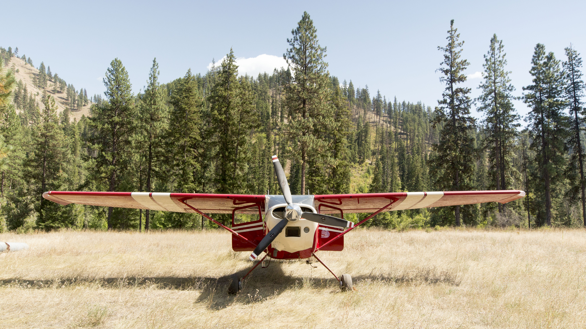

This airplane has been sold and she's off to a great home. I'm happy to pass her on to a pilot who can appreciate this plane as much as I did.

If you're in the market for a tailwheel airplane, I highly recommend the 180/185 series aircraft.  They are amazing performers and relatively easy on the pilot, although you should definitely get some training from someone who flies them well.

[Backcountry Pilot](https://www.backcountrypilot.org)
