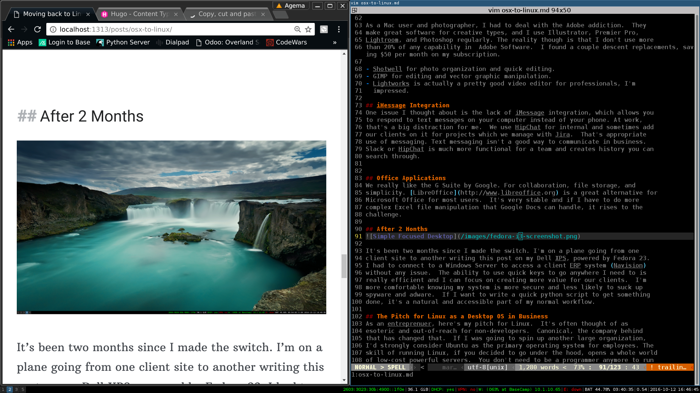

If you're considering switching to Linux as your primary OS, it's worth it. It's
a learning curve that leads to independence and workflow optimization. Whether
you're building software or connecting to a variety of operating systems I
appreciate the flexibility and ease of integration that Linux OS provides.  If
you're thinking of saving a lot of money on licenses and getting every ounce of
performance from your existing hardware, Ubuntu or Red Hat is a realistic and viable alternative.

When I was in the sixth grade I started programming and building
websites.  In 1990, that involved Textpad on Windows 3.1, which was an
upgrade from theCommodore 64 and Apple IIe I started with. After six months or so, I
developed an irrestible itch to learn Linux, which I now know was only
in early infancy.

After converting our home desktop to Red Hat Linux in the mid-90s, I was happy to have the mental challenge of running my own machine and inspired by the power of computers to do amazing things. Despite my love of tinkering, I didn't pursue it as a career.  The skill however is an invaluable tool in business which we'll get into later. I took my Red Hat machine to college and continued to play which turned out to be a smart move.

Since then, I've started and run several businesses with a lot of employees. I've always been stuck between running Linux for tinkering and our servers, but working on on Windows or OSX so my employees don't quit or go crazy.  As a business owner though, I need stable systems that are usable, secure, scalable and manageable. This has led most of our companies to adopt Apple's OSX as the operating system of choice with applications being cloud-based for the most part.

My love of Linux has only grown through the years and my team at
[Agema](https://www.agemalabs.com) is tech-savy.  We run clusters of Linux servers
and use Google Apps for document creation, document storage, and email. We work with
clients running Windows though, and I own other companies where
employees are using OSX primarily. Several months ago, I pulled the trigger and built up a
Linux laptop to see if I could make the switch while increasing efficiency.
Despite having to interface with different operating systems and doing the daily
work we do with clients, life has actually gotten easier.

## Switching Over to Linux from Mac OSX

First of all, Apple makes an amazing operating system.  It's integrated with
iPhones and iPads and provides a mostly stable and seamless experience.  In 15
years and over 100 Macs purchased for our companies, we've never had an issue
with viruses, instability, or user adoption.  I don't hate Windows, but I've had
consistent issues throughout the years with upgrades, and licenses.  On the
server side we've run multiple windows servers throughout the years and they
take a lot of work to maintain and tune, and they're expensive. In short, we haven't figured out how to
move quickly with Windows and I'm open to that being a lack of understanding or
skills on my teams part.

I do like the idea of insulating myself from user tracking, the reality is that I am really not
that interesting. My primary motivation was based on the ability to build a system that
I could customize, access open source tools I use for playing with radios ([hackrf](http://www.greatscottgadgets.com/hackrf)), product design with 3D printing support,  easily connect to whatever system I need to, and minimize mouse use.

If you're reading this, and you have that itch to go open-source, you should do
it.  That urge won't leave you, just don't sell your Macbook immediately.  A
friend had an extra Dell XPS 13 laying around running windows. I installed the
latest Ubuntu version on it and was up and running.  After a couple days working
with clients, doing presentations, and using remote-desktop to access Windows
Server applications, the only problem I've run into is opening SolidWorks CAD which requires Windows.

After a month of Ubuntu, which is a great starting point, I switched to Fedora
24 with the i3 windows manager. I did a lot of research and stayed up late running
every distribution I could get my hands on.  From an enterprise standpoint,
Fedora provides a good blend of security and leading edge upgrades to keep me
engaged. It's also optimized for the GNOME desktop, which is easy for employees to use. It wasn't the simplest installation process on the planet due to  Broadwell Drivers for wireless and bluetooth being a little finicky, but easily fixed after some google research. 

Choosing which flavor of Linux makes sense mixed with hardware compatibility is the topic of another blog. In short, I installed multiple distributions on the XPS 13 (not the developer edition) fairly
effortlessly.

## Dealing with Adobe

As a Mac user and photographer, I had to deal with the Adobe addiction.  They
make great software for creative types, and I use Illustrator, Premier Pro,
Lightroom, and Photoshop regularly. The reality though is that I don't use more
than 20% of any capability in  Adobe Software.  I found a couple descent replacements, saving $50 per month on my subscription.

- Shotwell for photo organization and quick editing.
- GIMP for editing and vector graphic manipulation.
- Lightworks is actually a pretty good video editor for professionals, I'm
  impressed.

## iMessage Integration
One issue I thought about is the lack of iMessage integration, which allows you
to respond to text messages on your computer instead of your phone. At work,
that's a big distraction for me.  We use HipChat for internal chat and sometimes add
our clients on it for projects which we manage with Jira.  That's appropriate
use of messaging. Text messaging isn't a good way to communicate in business.
Slack or HipChat is much more functional for a team and creates history you can
search through.

## Office Applications
We really like the G Suite by Google. For collaboration, file storage, and
simplicity. [LibreOffice](http://www.libreoffice.org) is a great alternative for
Microsoft Office for most users.  It's very stable and if I have to do more
complex Excel file manipulation that Google Docs can handle, it rises to the
challenge.

## After 2 Months

It's been two months since I made the switch. I'm on a plane going from one
client site to another writing this post on my Dell XPS, powered by Fedora 24.
I had to connect to a Windows Server to access a client ERP system (Navision)
without any issue.  The ability to use quick keys to go anywhere I need to is
really efficient and I can focus on creating more value for our clients.  I'm
more comfortable knowing my system is more secure and less likely to suck up
spyware and adware.  If I want to write a quick python script to get something
done, it's a natural and accessible part of my normal workflow.

With the i3 window manager, I find my work to be much more focused and
distraction free. Productivity with multiple screens has improved as
well.

## The Pitch for Linux as a Desktop OS in Business
As an entreprenuer, here's my pitch for Linux.  It's often thought of as
esoteric and out-of-reach for non-developers.  Canonical, the company behind Ubuntu that has changed that.  If I was going to spin up another large organization,I'd strongly consider Ubuntu or Red Hat as the primary operating system for employees. The skill of running Linux, if you decided to go under the hood, opens a whole world
of low-cost powerful servers.  You don't need to be a programmer anymore to run it.  You can make it your own and develop the understanding of how your computer works, which directly translates to running very powerful with Linux servers.
